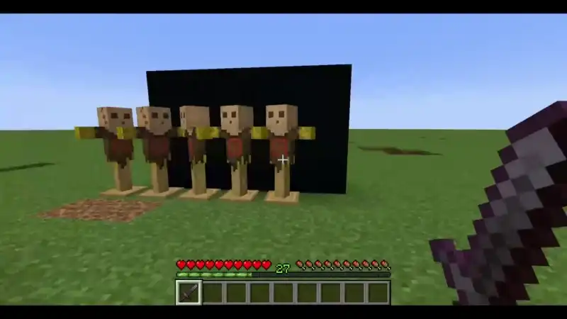

# Raft's Combat

A mod that aims to give the player's basic attacks more reach whilst staying close to vanilla's instantaneous attacks feel. Inspired by SKADA and Better Combat:

It functions by progressively summoning raycasts which are horizontally parallel the player's view vector. Their max range is represented by the range indicator which grows larger as the attack key is held, until it reaches its maximum width. Upon reaching maximum width, the fullness indicator will apear at the edge of the range indicator. On release of the attack key, the attack will be performed and will hit all entities detected in the "area" (the raycasts were designed as such that they "pierce" entities and as such will not only hit the first entity in front of you but the ones behind it as well). The horizontal offset is necessary in order to hit targets which are very near the player but which are present outside the range indicator:

(image here)

The indicator will switch to a red color if at least one entity is detected within range

Tamed entities which you own shouldn't be targetable. The same is true for mounts that are tamed and that aren't targeting the player (since for some reason they don't have owners, thanks Mojang)

Similar to bows, the attack can be cancelled by scrolling to another item in the hotbar

A special interaction happens with shields: When a charge is ongoing and a shield is held up, there is no need to also hold the attack key to continue the charge. The attack will happen as soon as the shield is lowered. This is to reduce the mental load of managing the mouse. For now, only the shield has this functionality

Critical Hits and Mace attacks are also special in the sense that the mod restricts them to the first attack which is registered, otherwise the damage would go too crazy. Raycasts near the crosshair should be prioritized since they are created and handled first.

The mod works on all items that have the `c:tools/melee_weapon` tag. If the item also happens to be a tool which has blocks on which it is effective on (such as axes on wood), then the mod will first check if the block being targeted by the crosshair raycast is a block which benefits from the tool. If it is, then the tool will enter its harvest mode until the attack button is released. If no such blocks are detected, then the tool will be treated as a weapon and a charge will initiate:

(video here)

## Limitations

1. Certain items, when used, impede initiating a charge or being used during a charge, such as foods, potions, bows and crossbows. This is a design decision which could be turned into a config in a future update if there are enough voices for it in the Issues

2. Since this works as a(n) (*cough* ~~better~~) implementation of Sweeping Edge, the mod disables the functionality of Sweeping Edge. You can enchant a weapon with Sweeping Edge, but it won't do anything. Similarly with point 1, this can be overturned if an Issue is posted

3. When hit, the range indicator will fling wildly. See the *Help Wanted From Benevolant Rendering Wizards* section for more information

## Configanigans
I love configuration, so if there are relevant features which you would want to see this mod handle feel free to make an Issue about it. Otherwise, here is what the mod lets you configure:

### Client

- Whether the crosshair should change color as well when at least one entity is in range
- The alpha value of the range indicator at max charge (will also be shared with the fullness indicator)
- The height of the range indicator (doesn't widen the vertical range, only visual)

### Server

- By default, attacks do not do knockback if the charge is below 60%. This is to avoid knockback spam with low-commital attacks, *but you may be into that* so there is an option to specify where the minimal % should be for knockback to be incurred
- The default width (ratio) of the attack range indicator
- Custom widths for specific items. Regex and lists both are supported, but have to be implemented through a very cursed string format. See config example

## Help Wanted From Benevolant Rendering Wizards (Technical Jargon Ahead!)

I personally don't know how to reverse roll transformations to the poseStack so that the rendered attack range indicator won't bob like crazy when view bobbing is on (whislt walking) whilst keeping its effect on the camera roll, so the solution so far is to eliminate the camera roll when view bobbing is on. To be fair, to be it's barely noticeable but it is worth mentioning. For those who don't know what I mean, the attack range indicator will display this behavior when you have it active and you receive damage, but I find this acceptable since the damage window is short compared to having view bobbing forever on. 
